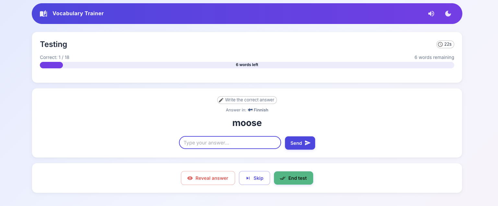
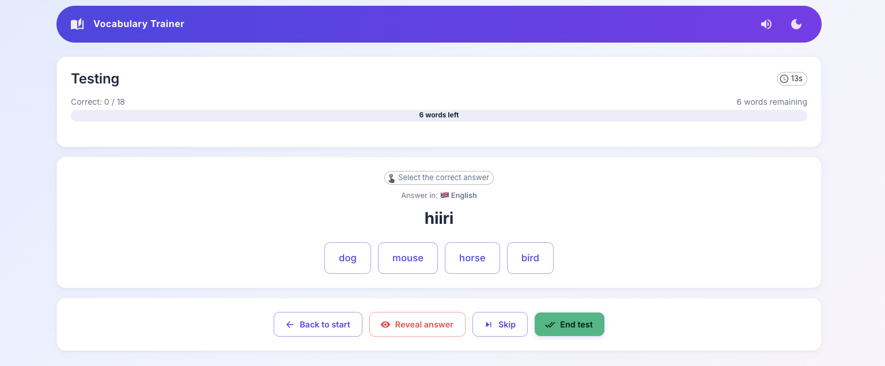
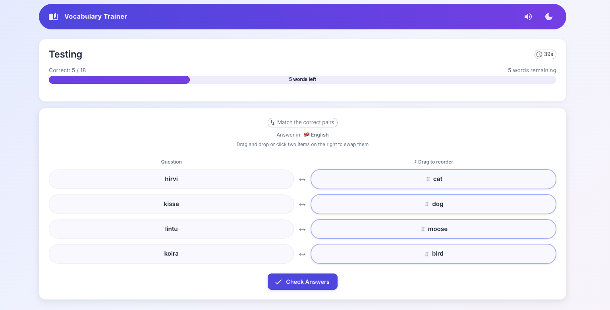
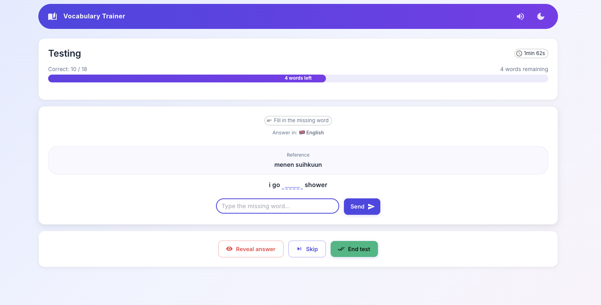
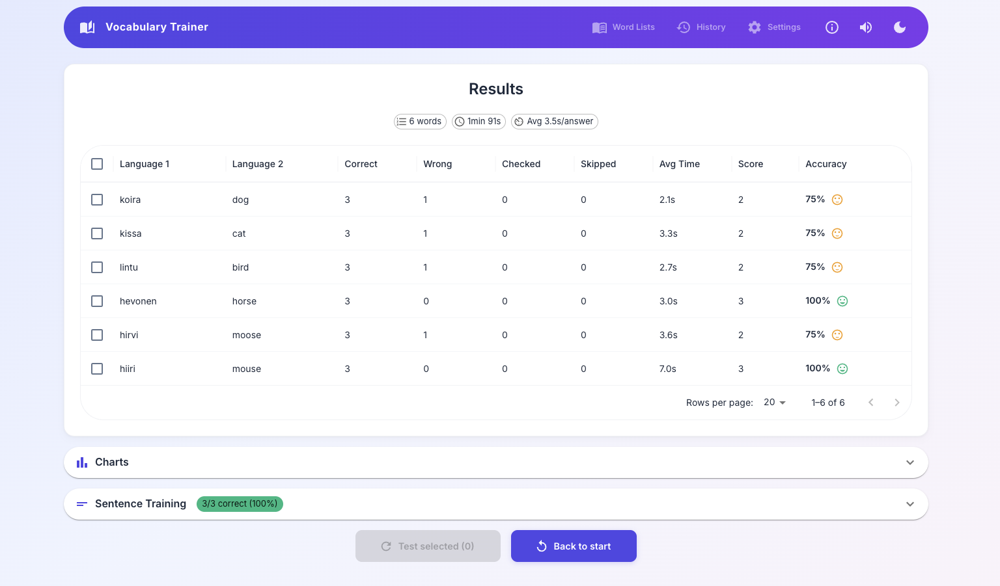
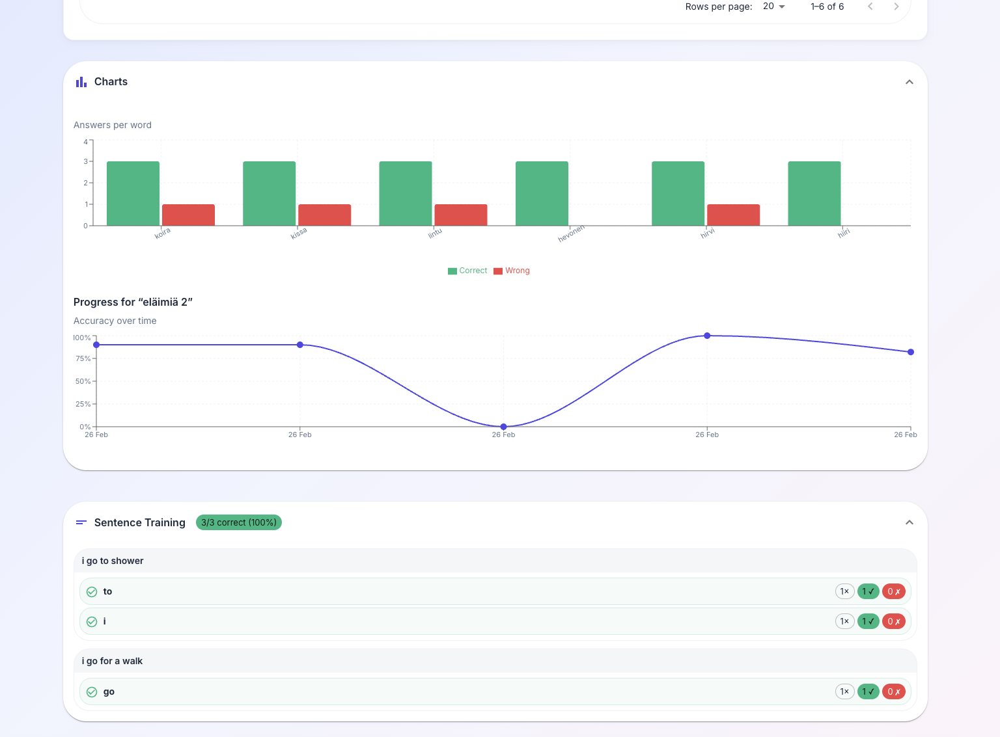
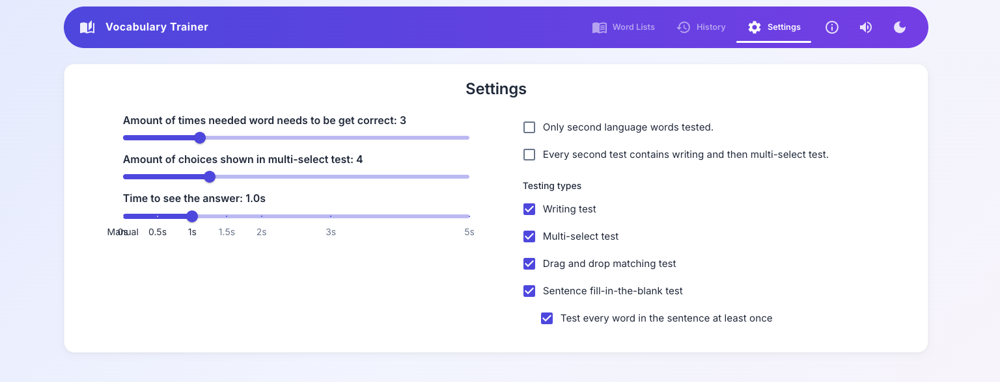
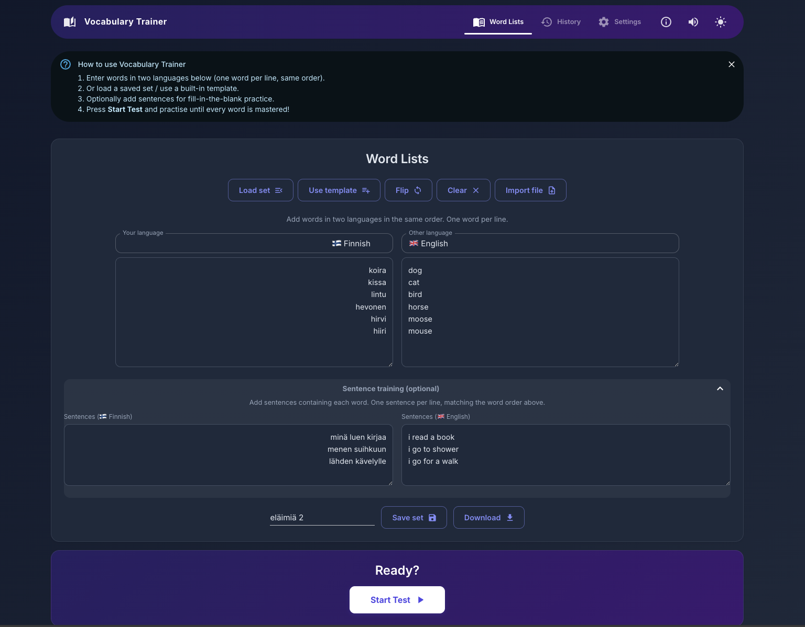

[](https://github.com/Crare/vocabulary-app/actions/workflows/pages/pages-build-deployment)

# Vocabulary Trainer

> Learn any language vocabulary — add your own words or use built-in templates and let the app quiz you until every word sticks.

https://crare.github.io/vocabulary-app/

## Features

- **Custom word lists** — type words in two languages (one per line), or import/export JSON files.
- **Built-in templates** — Finnish–Swedish sets included; load them with one click.
- **Multiple test modes** — writing, multi-select, drag-and-drop matching, and sentence fill-in-the-blank.
- **Sentence training** — optionally add sentences for contextual practice.
- **Configurable difficulty** — adjust how many correct answers are needed, number of choices, answer delay, etc.
- **Progress tracking** — results, charts, and full test history stored in local storage.
- **Dark mode** — toggle between light and dark themes.
- **Sound effects** — synthesised audio feedback with adjustable volume.
- **Tooltips & instructions** — hover over buttons and controls for contextual help; a dismissible "How to use" banner guides new users.
- **Offline-ready** — works fully in the browser; no server required.

## Accessibility

The app follows WAI-ARIA best practices:

- **Skip-to-content link** — keyboard users can jump straight to the main area.
- **Semantic landmarks** — `<nav>`, `<main>` and proper heading hierarchy.
- **ARIA labels** — all inputs, sliders, buttons, and interactive elements have meaningful labels.
- **Live regions** — test results (correct / incorrect) are announced to screen readers via `aria-live="assertive"`.
- **Keyboard navigation** — drag-and-drop items support Enter / Space as alternatives; all controls are reachable via Tab.
- **Color contrast** — default theme colours meet WCAG AA.
- **Focus management** — text inputs auto-focus when a new question appears.

## Screenshots

**Input your own words or use existing sets. Any language possible, if you have the words for both languages.**


**Writing test, randomly switching between both languages.**



**Multiselection test, randomly switching between both languages.**



**Drag and drop words in order.**



**Fill in words for sentences.**



**Check results after test, see what words you have to improve more.**



**Check graphs for progress.**



**Change settings to your liking.**



**Try dark mode for those late night hours.**



## Tech stack

- [React](https://react.dev/) 19
- [Vite](https://vite.dev/) 5
- [TypeScript](https://www.typescriptlang.org/) 5
- [MUI](https://mui.com/) 7
- [Vitest](https://vitest.dev/) for testing
- Deployed to [GitHub Pages](https://pages.github.com/)

## Install

```sh
npm install
```

## Run

```sh
npm run dev
```

Opens at http://localhost:3000/vocabulary-app/

## Build

```sh
npm run build
```

## Test

Tests live in the `tests/` folder and use [Vitest](https://vitest.dev/).

Run once:

```sh
npm test -- --run
```

Run in watch mode:

```sh
npm test
```

## Preview production build locally

```sh
npm run preview
```

## Deploy to GitHub Pages

```sh
npm run deploy
```

## Project structure

```
src/
  pages/          # Route-level views (Main, Settings, Testing, Results, History, Credits)
  components/     # Shared UI components (charts, tables, chips)
  hooks/          # Custom React hooks
  util/           # Helpers, storage, logger, sounds
  wordsets/       # Built-in word set JSON files & types
tests/            # Vitest unit tests
.spec/            # Architecture & design specs for AI agents
```

## AI agent guidance

See [`src/AGENTS.md`](src/AGENTS.md) and the [`.spec/`](.spec/) directory for architecture docs, data models, and coding conventions aimed at AI coding assistants.
